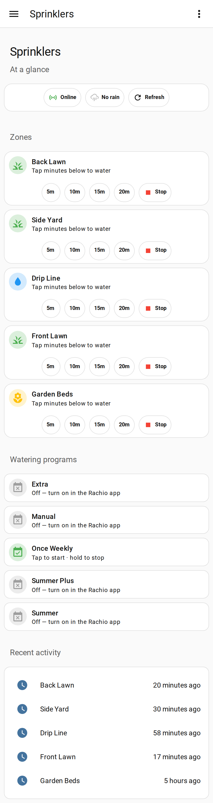

# Rachio Sprinkler Dashboard for Home Assistant

A clean, mobile-friendly [Home Assistant](https://www.home-assistant.io/) dashboard for
**Rachio** sprinkler controllers running the
[`biofects/rachio_local`](https://github.com/biofects/rachio_local) integration.

Run one zone for a set time with a tap, start a saved Rachio program, and see live
status — the **active zone fills blue**, and a **Stop all** button appears only while
something is watering.

<p align="center">
  
</p>

## Features

- **Per-zone control** — each zone is one card with `5 / 10 / 15 / 20` minute buttons and a Stop.
- **Live active state** — the watering zone fills blue, its icon becomes a sprinkler, status reads "Watering now".
- **Programs** — the Watering programs section **auto-discovers** your Rachio schedules: one tap starts a program, and programs you add, remove, or rename in the Rachio app appear here automatically (after a `rachio_local` reload). Unavailable/orphaned programs are hidden.
- **Contextual Stop all** — a red "Stop all watering" button appears at the top *only* while a zone or program is running.
- **At a glance** — controller online, rain sensor, and a manual refresh.
- **Recent activity** — when each zone was last watered.
- **Live labels** — every zone/program name is read from the entity at render time, so renames in the Rachio app show up without editing the dashboard.
- Built on **Mushroom** + **card-mod** + **auto-entities** — all common HACS cards.

## Why a generator?

Every Rachio setup has different zones, so the dashboard can't ship with hard-coded
entity IDs. Instead, `generate_dashboard.py` reads **your** entities straight from the
Home Assistant API and writes a dashboard tailored to your zones — nothing to hand-edit.

## Requirements

- Home Assistant with the [`biofects/rachio_local`](https://github.com/biofects/rachio_local) integration set up.
- HACS frontend cards: **Mushroom** (`piitaya/lovelace-mushroom`), **card-mod** (`thomasloven/lovelace-card-mod`), and **auto-entities** (`thomasloven/lovelace-auto-entities`).
- Python 3 (standard library only) to run the generator.

## Quick start

**1. Install the HACS cards** (Mushroom + card-mod + auto-entities), then hard-refresh your browser.

**2. Generate your dashboard.** Create a Home Assistant *long-lived access token*
(profile → Security → Long-lived access tokens), then:

```bash
HA_URL=http://homeassistant.local:8123 HA_TOKEN=xxxxxxxx python3 generate_dashboard.py
```

This writes two files:
- `sprinklers.yaml` — the dashboard
- `rachio_dashboard.yaml` — a one-line "stop all watering" helper script

**3. Add the helper script.** Copy `rachio_dashboard.yaml` to `<config>/packages/`,
and make sure your `configuration.yaml` has:

```yaml
homeassistant:
  packages: !include_dir_named packages
```

Restart Home Assistant.

**4. Add the dashboard.** Create a new dashboard → top-right ⋮ → **Edit Dashboard** →
⋮ → **Raw configuration editor** → paste the contents of `sprinklers.yaml`.

Done. Tap a zone's minute button to water; tap again on **Stop** (or **Stop all**) to stop.

## Good to know

- **Live updates:** runs you start here show immediately; runs started elsewhere (the
  Rachio app, or a schedule firing on its own) appear on the next poll — up to ~5 min
  when idle. Tap **Refresh** to pull sooner. (The integration is poll-based.)
- **Stop = whole controller:** Rachio's API has no per-zone stop, so any **Stop** button
  (and **Stop all**) stops the entire controller. On a Gen-series controller only one
  zone runs at a time, so this does what you'd expect.
- **Disabled programs** can't be started from Home Assistant — enable them in the Rachio app first.

## Customizing

Open `generate_dashboard.py`:
- **Minute presets** — change `(5, 10, 15, 20)` in `zone_card()`.
- **Active color** — change the `BLUE` gradient at the top.
- **Icons** — tweak the keyword heuristics in `icon_for()`.

## Credits

- Built for the [`biofects/rachio_local`](https://github.com/biofects/rachio_local) integration by **@biofects**.
- UI uses [Mushroom](https://github.com/piitaya/lovelace-mushroom) and [card-mod](https://github.com/thomasloven/lovelace-card-mod).

## License

MIT — see [LICENSE](LICENSE).
